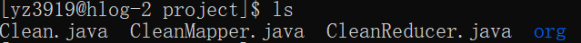
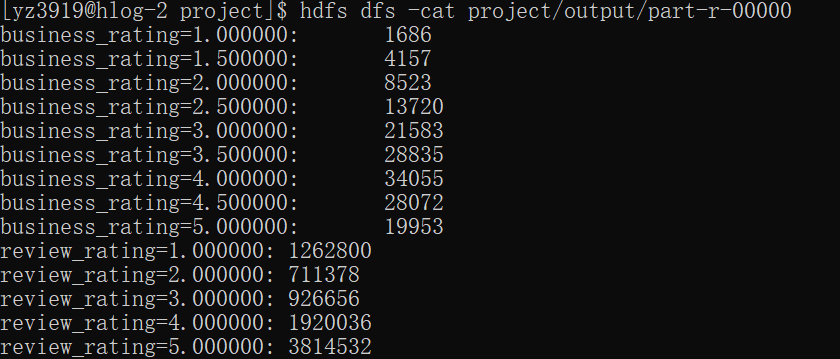
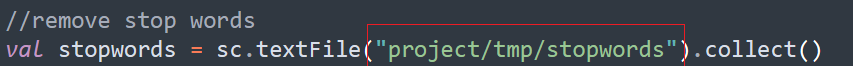
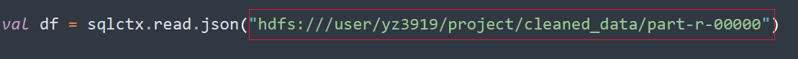

# Intro

This project done in Big data analytical tools analyzes the public dataset provided by [Yelp](https://www.yelp.com/dataset) and contains mainly two parts: topic extraction and sentiment analysis on user reviews. The purpose of this project is to examine what are the most important elements for a successful restaurant, as well as if people are able to quantify their feelings well into ratings. The project discovered that the hottest review topics for high rating restaurants and low rating restaurants, and the average of all review ratings is 3.73, on a scale of 1-5, while the predicted sentiment score is 0.235, on a scale of -1 to 1. We can see that both averages are slightly better than the mean of the evaluation metrics, indicating that people can quantify their feelings fairly well. 


# Input Data on HDFS


- input data (yelp_academic_dataset_business.json,yelp_academic_dataset_review.json) can be found under yelp_project directory under user bz1037, then directory is shared with adm209, nks8839, and sj3549 as shown in screenshot in Sceenshot/bz1037/Clean folder


# Files and Directories

**/ana_code**

- clean.jar: MapReduce job for cleaning the yelp dataset
- profile.jar: MapReduce job for analyzing the distribution of ratings
- topic_extraction.sc: Scala commands to be run in Spark interactive shell for topic extraction
- ./org: org.json, the package used for handling JSON file. You will need to have it if you want to compile the jars by yourself. 
- /bz1037_analytics/yelp_find_topic_reviews.sc: Pulls out reviews with Machine Learning extracted topics sorted by ratings. The screenshots of the program running can be found in Sceenshot/bz1037/Analytics. 
- /bz1037_analytics/yelp_project.py: Conducts sentiment analysis on all reviews, computing a sentiment score for each review based on its positivity using TextBlob package. The sentiment score ranges from -1 to 1, with 1 being very positive and -1 being very negative. It is written in pyspark, and the result can also be found in Sceenshot/bz1037/Analytics. To run the program, simply copy and paste the code into Pyspark shell.

**/data_ingestion**

- commands.txt: commands for populating the original dataset into HDFS
- /bz1037/commands.rtf: how data is transported to hdfs. The list of commands are contained in a rtf text file.

**/etl_code/yz3919**

- *.java: source code of clean.jar

**/profiling_code/yz3919**

- *.java: source code for profile.jar

**/etl_code/bz1037**

- *.java: source code of clean.jar

**/profiling_code/bz1037**

- *.java: source code for profile.jar

# How to Run For Topic Extraction

### Data Ingestion

1. Download full dataset from [Yelp](https://www.yelp.com/dataset)
2. Populate the data into HDFS (see /data_ingestion/commands.txt for detail commands)

### Data Cleaning 

This MapReduce job extracts review.json and business.json from the aggregated dataset and join them using the "business_id" field. 

- **You can directly run the clean.jar file by**

```shell
hadoop jar clean.jar Clean {path of your original dataset on hdfs} {your desired output path on hdfs}
```

- **Or you can compile the jar file by yourself and then run it**

1. In your working directory, make sure your you have "/etl_code/yz3919/*.java" and "ana_code/org"

   

2. Do

   ```shell
   javac -cp `yarn classpath`:. CleanMapper.java
   ```

   ```shell
   javac -cp `yarn classpath`:. CleanReducer.java
   ```

   ```shell
   javac -cp `yarn classpath`:. Clean.java
   ```

   ```shell
   jar -cvf clean.jar *.class org/json/*.class
   ```

3. Cleaned data is ready for use as input for topic extraction.


### Data Profiling

This MapReduce job runs on the ORIGINAL Yelp dataset, not the cleaned one.

- **You can directly run the profile.jar file by**

```shell
hadoop jar profile.jar Profile {path of your original Yelp dataset on hdfs} {your desired output path on hdfs}
```

- **Or you can compile the jar file by yourself and then run it**

1. In your working directory, make your you have "/profile_code/yz3919/*.java" and "ana_code/org" (similar to data cleaning above)

   

2. Do

   ```shell
   javac -cp `yarn classpath`:. ProfileMapper.java
   ```

   ```shell
   javac -cp `yarn classpath`:. ProfileReducer.java
   ```

   ```shell
   javac -cp `yarn classpath`:. Profile.java
   ```

   ```shell
   jar -cvf profile.jar *.class org/json/*.class
   ```

3.  Output shows the distribution of ratings

   


### Topic Extraction

Analyze topics of all reviews as well as reviews of good (rating = 1 - 2.5) and bad (rating = 4.5 - 5) businesses.

This runs on the CLEANED data and not the original Yelp dataset.

1. Download a stop word file

   ```
   wget http://ir.dcs.gla.ac.uk/resources/linguistic_utils/stop_words -O {your path on peel}
   ```

2. Open spark interactive shell

   ```
   spark-shell --deploy-mode client
   ```

3. Make sure you change the file paths to your own in *topic_extraction.sc*

   - stop word file path

     

   - input file path (output from the data cleaning process above)

     

4. Select all code in *topic_extraction.sc* and copy paste into shell. (When the last print command is reached, you may hit enter to run it)

5. Outputs are printed directly in the sequence of all reviews topics, good business review topics and bad business review topics.


# How to Run for Sentiment Analysis


## Ingestion


In **data_ingest/bz1037** is how data is transported to hdfs. The list of commands are contained in a rtf text file.


## Clean


In **etl_code/bz1037** is the mapreduce program of selecting the useful columns in a dataset. Both java and class files are provided. The result of the program are screenshoted in Sceenshot/bz1037/Clean folder. It can also be accessed in hdfs yelp_project/output_clean.


## Profiling


In **profiling_code/bz1037**, there is the mapreduce program of counting total rows in a dataset. Both java and class files are provided.The result of the program are screenshoted in Sceenshot/bz1037/Clean folder. It can also be accessed in hdfs yelp_project/original_data_count.

In **profiling_code/bz1037**, there is also yelp_profiling.sc that contains several spark sql queries written in Scala to gain a better understanding of the dataset. The screenshots of the program running can be found in Sceenshot/bz1037/Profile. To run the program, simply copy and paste the code into Scala interactive repl.


## Analytics

All analytics code are contained in ana_code/bz1037_analytics. The yelp_find_topic_reviews.sc pulls out reviews with Machine Learning extracted topics (see partner yz3919's topic extraction ) sorted by ratings. The screenshots of the program running can be found in Sceenshot/bz1037/Analytics. The yelp_project.py conducts sentiment analysis on all reviews, computing a sentiment score for each review based on its positivity using TextBlob package. The sentiment score ranges from -1 to 1, with 1 being very positive and -1 being very negative. It is written in payspark, and the result can also be found in Sceenshot/bz1037/Analytics. To run the program, simply copy and paste the code into Pyspark shell.


The final result of sentiment analysis shows the average of all review ratings is 3.73, on a scale of 1-5, while the predicted sentiment score is 0.235, on a scale of -1 to 1. We can see that both mean are slightly better than the mean of the evaluation metrics, indicating that people can quantify their feelings pretty well. 

